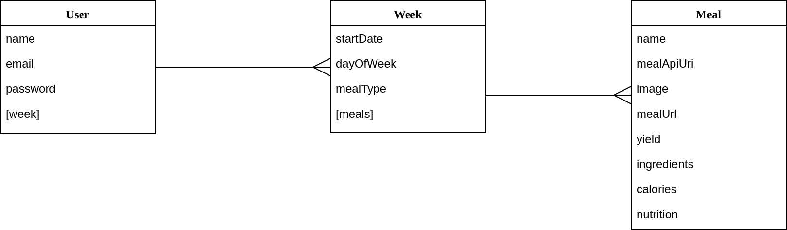
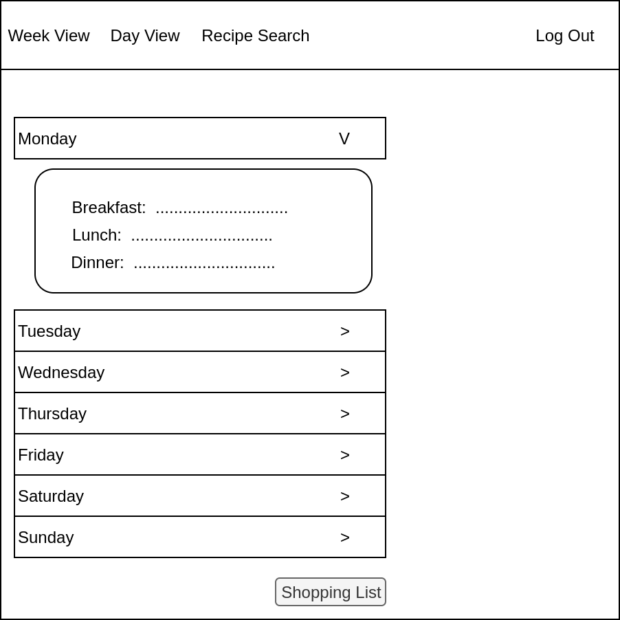
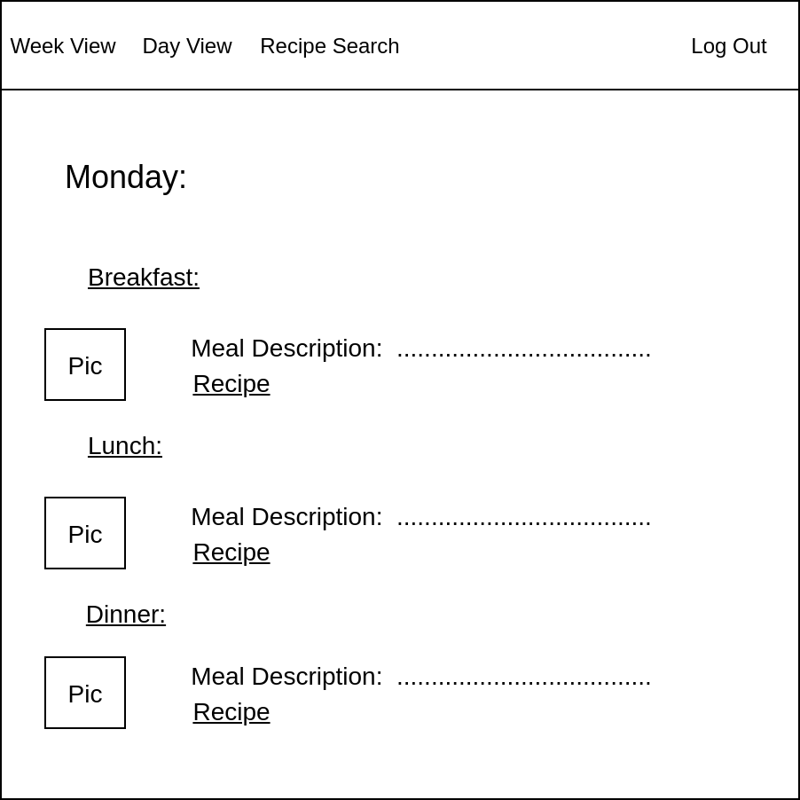
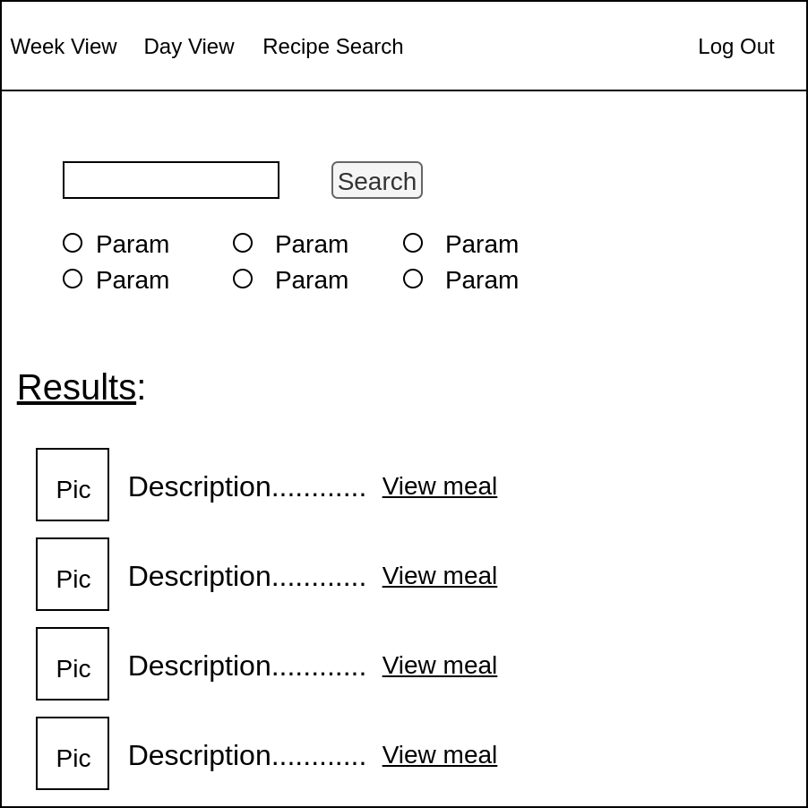
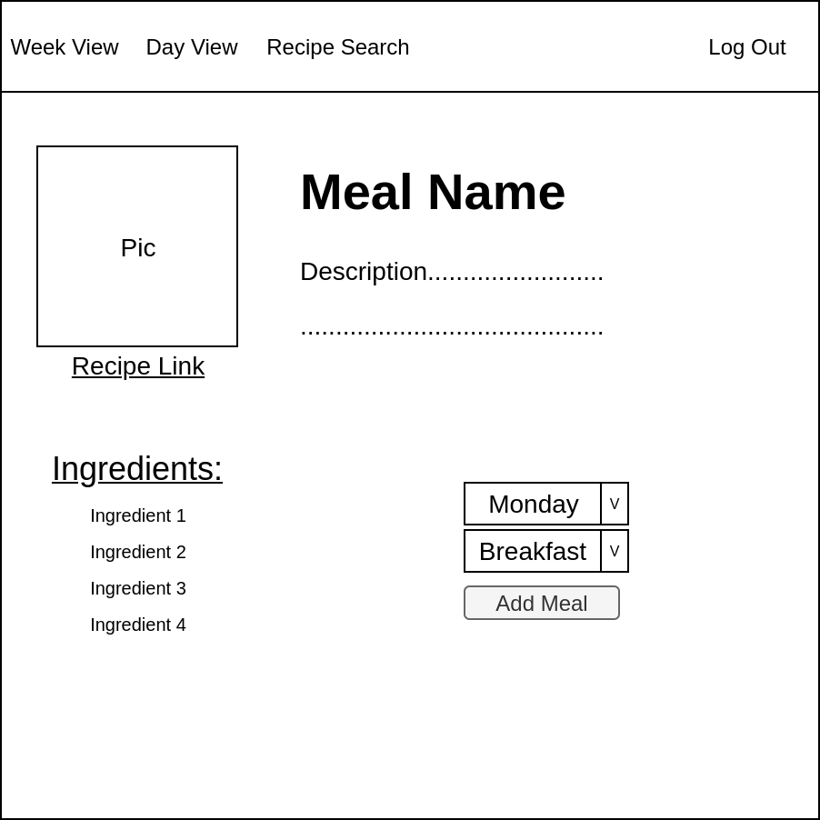

# Meal Planner App
## 
## 
## Objective:  
### - Create an app that allows a user to plan meals out for a week.
## 
## 
## 
## The app can be found [here](https://deployedproject.com)
## 
## 
## Motivation:
### I've used several meal planning apps, but each of the ones I've used is missing one key piece of functionality that I'm looking for.  Some of them have great recipe search engines, but don't allow a user to save meals, some of them allow a user to set meals for each day, but only allow custom recipes, and some don't allow a place to view nutritional information.  My motivation for this project is to design an app that takes the best elements of apps I've used in the past and combine them into one that I'll WANT to use on a weekly basis.
## 
## 
## Prototype View:
### Here is my ERD for the data to be stored in my database:

### Here are each of the pages I would like to display:
## Login Page

## Week View

## Day View

## Recipe Search

## Recipe Detail

## 
## 
## 
## Technology Implemented:
- JavaScript
- CSS
- HTML
- Git
- Express
- MongoDB
- Node.js
- Heroku
- React
- JWT

## API
### All recipes and nutritional information are being pulled using the [Edamam](https://www.edamam.com) API. 

## Minimum Viable Product:
- AAU, I should be able to sign up by providing a name, email, and password.
- AAU, I should be able to log in, using the email and password used to sign up.
- AAU, I should be able to view a week of upcoming meals by day.
- AAU, I should be able to search for recipes.
- AAU, I should be able to add a meal to a specified day of the week.
- AAU, I should be able to view a separate page for each day of week, detailing the meals I've selected for the specified day.
- AAU, I should be able to view a meal's recipe by clicking on a link.
## Stretch Goals:
- AAU, I should be able to print a weekly shopping list generated from each of the meals scheduled for that week.
- AAU, I should be able to change the nutritional parameters of the recipe search to account for allergies/dietary restrictions.

